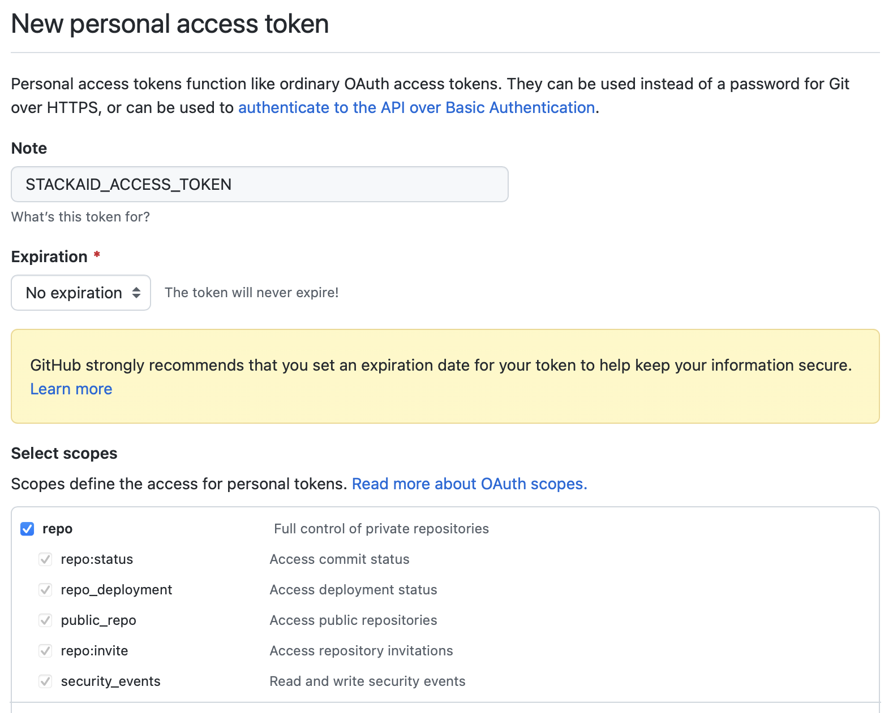
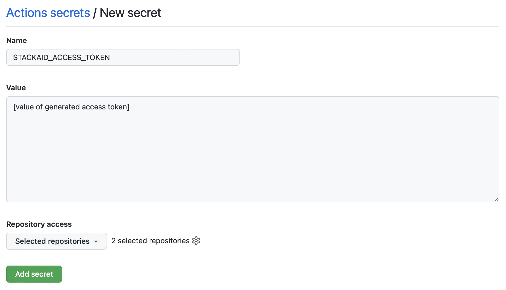

[](https://github.com/stackaid/generate-stackaid-json/actions/workflows/test.yml)

# generate-stackaid-json

A GitHub action to generate a stackaid.json file based on your repository's dependency graph

This action is primarily intended to support funding your dependencies on StackAid for ecosystems that are not yet natively supported (eg: Go, PHP, Python, etc.).

By using the GitHub dependency graph API this action is able to discover your direct and indirect dependencies and generate a `stackaid.json` file which can then be discovered and used by StackAid to fund your dependencies.

Here's an example workflow to add to your repository:

```yaml
name: 'fund-on-stackaid'
on:
  push:
    branches:
      - main
jobs:
  stackaid-json:
    runs-on: ubuntu-latest
    steps:
      - uses: actions/checkout@v2
      - uses: actions/setup-go@v3 # Only required for Go based repos
      - uses: stackaid/generate-stackaid-json@v1.8
```

This will commit a `stackaid.json` file in your repository which will then automatically show up for funding in the StackAid dashboard.

The action also supports a few useful `inputs` and `outputs` so you can publish to a different repository or skip publishing all together and consume the generated stackaid.json in another action.

### Inputs

- `token`: An access token which has repo permissions. By default the action uses `${{ github.token }}` automatically provided by the action runner.
- `publish_repo`: The full name of the repository, (eg: `username/repo-name`) to publish the generated stackaid.json file. Defaults to the current repository.
- `publish_path`: The path to publish to. By default the stackaid.json file is published to the root of the repository.
- `skip_publish`: Set to `true` if you do not want to publish the generated file.
- `include_package_json`: Only relavant when `publish_repo` is specified. Set to `true` if you want to copy `package.json` files to a non-sensitive repo. See the section below. Defaults to `true`.

**Note**: If you publish to a separate repo you will need to provide a [personal access token](https://docs.github.com/en/authentication/keeping-your-account-and-data-secure/creating-a-personal-access-token) with the appropriate repo permissions.

### Outputs

- `stackaid_json`: The generated stackaid.json file as a string.

## Funding dependencies in sensitive repositories.

While this action is primarily designed to support languages StackAid does not natively support, it can also be used to allow you to fund dependencies in repositories without giving StackAid access to your source code.

Here's a simple guide:

1. Create a new empty repository and grant acess to our [GitHub app](https://github.com/apps/stackaid). This repository will just store the dependecy files you want to fund.

2. Create a [personal access token](https://github.com/settings/tokens/new) with full `repo` access and set the expriation to "No Expiration"
   

3. Add the token as a secret to your github action workflow: https://docs.github.com/en/actions/security-guides/encrypted-secrets
   

4. Configure this GitHub action to publish to your new repository.

```yaml
token: ${{ secrets.STACKAID_ACCESS_TOKEN }}
publish_repo: 'owner/name' # of new repository
publish_path: ${{ github.repository }} # Publishes dependecy files under the current repo name. Avoids name conflicts when using this action on multiple repositories.
```
